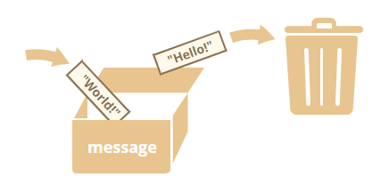
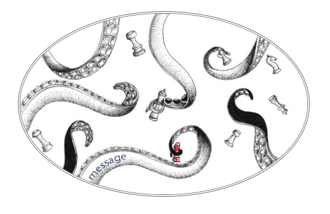
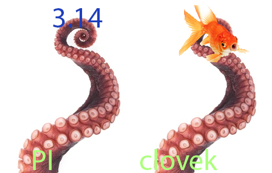

# Proměnné - let, const, var

```js
// nový zápis
let promenna1 = 1
const promenna2 = 2

// zastaralý zápis
var promenna3 = 3
```

Dosud jsme pro vytvoření nové proměnné používali pouze slovíčko **let**, ale ve skutečnosti má JS pro proměnné tři různá slovíčka (keyword): ```let, const a var```

## var

Je nejstarší způsob a protože měl určité 'mouchy', byly do nového JS přidány **let** a **const**, aby **var** nahradily. Var proto nebudeme používat.

## let

Nový způsob definice proměnné. Budeme ho používat namísto **var**.

## const

Jako konstant -> konstanta.<br>
Ve všem, až na jeden malý detail je **const** shodné s **let**. Narozdíl od **let**, ale jednou naplněné **const** už nelze naplnit jinou hodnotou.

## Opakování je matka ...

Jméno proměnné je složeno z písmen a čísel, ALE nesmí začínat číslem.
Také může obsahovat znaky **$** a **\_**.

```js
// toto je OK
let $ = 'dollar'
let _ = 'podtrzitko'
let cislo1 = 'podtrzitko'

// toto neni OK!
let 1cislo = "NEFUNGUJE .. jmeno promenne nesmi zacinat cislem"
let cislo* = "NEFUNGUJE .. nepovoleny znak ve jmene promenne"
```

### Pozor na:

Není možné jako jméno proměnné použít **keyword** z jazyka JS.

```js
// např.:
let var = "ahoj"
const for = "svete"
var while = "JS"
// atd.
```

A samozřejmě, není možné vytvořit proměnnou se jménem, která již používá jiná proměnná (ve stejném **scopu**):

```js
let zprava = "ahoj"
let zprava = "svete"
```

Proměnné jsou tzv. dynamicky typované - mohou obsahovat jakýkoliv typ:

```js
let x = 5
x = "Jablko"
```

Je osm datových typů:

1. **number** pro čísla (celá i desetinná),
1. **string** pro řetězce - prostě posloupnost znaků jako např. "ahoj",
1. **boolean** pro logické hodnoty - true/false (pravda/lež),
1. **object** – pro komplexní datové struktury
1. **undefined** – typ s jedinou hodnotou *undefined*, což znamená *prázdný - zatím jsi sem nic nedal*
1. **null** – typ s jedinou hodnotou *null*, což znamená něco jako *prázdný* nebo *nic tu není*
1. **bigint** pro obrovská celá čísla (nebudeme používat)
1. **symbol** pro unikátní identifikátory (nebudeme používat)

Pozn.: přestože

```js
typeof function () {}
// vypise: 'function'
```

je funkce brána jako datový typ 'object'. Můžeme to brát tak, že je to speciální typ objektu .. podmnožina objektu.

## Obrázek může být lepší než tisíc slov

```js
let message = "Hello"

//...

message = "World!"
```

<br>
<br>


**_Měli byste si přiřazení proměnné představovat spíše jako chapadla než krabice. Proměnná 'neobsahuje' hodnotu. 'Ukazuje' na ni - drží ji. Program může přistupovat jenom k těm hodnotám na které má odkaz (reference) .. ukazuje na ně nějaká proměnná. Pokud si potřebujete něco zapamatovat, vytvoříte 'chapadlo', které to chytne nebo tu věc dáte držet nějakému již vytvořenému chapadlu._**

# A teď trocha programátorského názvosloví a hnidopišství

## Declaration (deklarace)

```js
let cislo
```

Proměnná je vytvořena, ALE ještě jsme jí nedali žádná data. Její obsah bude teda defaultně **undefined**.

## Initializing (inicializace)

Až později ji můžeme využít k podržení např. čísla osm (inicializace):

```js
cislo = 8
```

## Definice (definice -> deklarace a zároveň inicializace)

```js
let cislo = 5
```

Proměnná je vytvořena (deklarace), a rovnou jsme jí předali číslo **5** (inicializace).

## Alternativní zápisy

Je možné definovat si několik proměnných za sebou pouze oddělených čárkami.

```js
let clovek = "Pepa", vek = 25, zprava = "ahoj lidi"
```

toto je shodné s tímto:

```js
let clovek = "Pepa"
let vek = 25
let zprava = "ahoj lidi"
```

První způsob zápisu oddělený čárkami můžeme 'roztáhnout' přes několik řádků:

```js
let clovek = "Pepa",
    vek = 25,
    zprava = "ahoj lidi"

// nebo i s čárkami vepředu

let clovek = "Pepa"
  , vek = 25
  , zprava = "ahoj lidi"
```

## Co znamená, že const lze definovat pouze jednou?

Obyčejné proměnné definované pomocí var nebo let jde měnit. Jednou do nich dáme třeba číslo pět, to potom nahradíme číslem osm atd. Const ale vychází ze jména konstanta a byl zaveden právě pro případy, kdy předem víme, že nechceme nikdy měnit to co do něj jednou přiřadíme. Je dobrým zvykem napříč programovacími jazyky psát jméno konstanty velkými písmeny. Tak je potom všem jasné, že pracují s konstanou.

Např:.

```js
const PI = 3.14159265359

// ...
// někde úplně jinde v kódu ...

function vypocet(cislo) {
  return cislo * PI
}
// každému je jasné už ze zápisu velkými písmeny že PI je nějaká konstanta
```

A teď si ukážeme rozdíl mezi primitivními a Objektovými datovými typy a co to pro nás znamená v souvislosti s **const**:

```js
// definice opravdové konstanty s primitivním datovým typem
const PI = 3.14159265359
//...
PI = 3.15
// -> Chyba! Konstanta uz má přiřazeno jiné číslo.

const clovek = { jmeno: "Karel", vek: 21 }

clovek.jmeno = "Melichar"

console.log(clovek) // -> {jmeno: "Melichar", vek: 21}
```



## Problémy s **var** a jak je řeší **let/const**

**_block scope_** vs **_function scope_**

```js
function nejakaFunkce() {
  var jedna = 1
  let bedna = "bedna"

  if (true) {
    var deset = 10
    let peset = "pesos"
  }

  console.log(jedna) // -> 1
  console.log(bedna) // -> 'bedna'
  console.log(deset) // -> 10
  console.log(peset) // -> Chyba! peset neni definovano!
}
```

Redeklarace:

```js
let cislo = 5
let cislo = 8
// -> Chyba! Proměnná číslo už existuje

var num = 4
var num = 8
// -> Vše OK ... to ale my nechceme! Chceme vědět, že jsme někde přepsali proměnnou
```

U var můžeme inicializovat proměnnou nad její deklarací

```js
cislo = 5
var cislo
// funguje (kvůli něčemu čemu říkáme hoisting - vyzdvižení)

num = 5
let num
// opraveno .. žádný hoisting .. toto nefunguje!
```

## Hoisting (vyzdvižení)

Definice funkcí a deklarace proměnných pomoví slovíčka **var** jsou tzv. hoisted - vyzdviženy. Můžete si to představit tak, že ještě než JS kód spustí, si ho celý projde a všechny deklarace pomocí **var** a všechny definice funkce přesune na vrch kódu.

Takže se z:

```js
mojeFunkce() // zavolání/spuštění funkce

num = 5 //inicializace proměnné

var num // deklarace proměnné

//definice funkce
function mojeFunkce() {
  return "neco"
}
```

stane:

```js
// --- toto bylo vyzdvizeno ---

var num // deklarace proměnné

//definice funkce
function mojeFunkce() {
  return "neco"
}
// ----------------------------

mojeFunkce() // zavolání/spuštění funkce

num = 5 //inicializace proměnné
```


# Materiály:

### Eloquent JavaScript: https://eloquentjavascript.net/index.html

### Javascript info: https://javascript.info/variables
