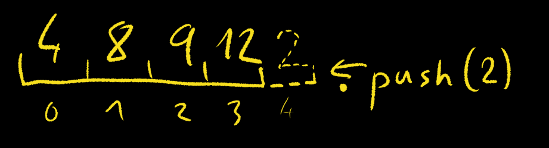
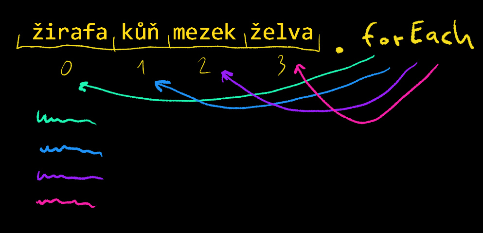

# Pole a Objekty

Pole a objekty jsou 'slozitejsi' nebo 'objektove' datove typy. 'Datovy typ' zni hrozne profesionalne, ale nebojte je to v podstate jenom oznaceni typu -> veci o ktere mluvime. Treba o tekutinach nebo o domech ... a z toho nam plyne co s takovymi typy muzeme delat a to je jeden z duvodu proc je rozlisujeme v programovani.

Kazdemu je jasne ze typ 'tekutina' muzeme nalit do sklenice, ale typ 'dum' ne.

Dalsim duvodem je ze 'nejde' udelat jeden typ na vsechno. Proto mame typ string kdyz chceme neco nekam napsat, nebo si treba ulozit neci jmeno. A typ number kdyz chceme neco spocitat, nebo si ulozit kolik co treba vazi.

Vime tedy ze number a string jsou tzv. primitivni datove typy a dneska si probereme nektere slozitejsi/objektove datove typy: Array (pole) a Object (objekt). 


Pozn.: obecne i v jinych jazycich ktere podporuji OOP se novy objekt vytvarit tak ze napiseme: 

```js 
new JmenoObjektu()
```

Tak muzeme v JS vytvaret jak Array ... new Array(), nebo objekt ... new Object(). V JS ale muzeme pole a objekty taky zapsat 'rovnou'/'naprimo' jako literal.


# Pole 
Pole je datovy typ ve kterem je spousta hodnot za sebou.


Muzete si to predstavit jako jedno baleni takovychto zvykacek.
Pole je tak dulezity a zakladni datovy typ ze ho najdeme napric vetsinou programovacich jazyku ale obcas s ruznymi odlisnostmi.

(treba Python tomu nerika Array (pole) ale List. Hodne jazyku take dovoluje jen jeden typ v jednom poli, napr. pole stringu, pole cisel apod. JS nam dovoli vkladat do pole co se nam zlibi)

Literal pole se v JS zapisuje takto:

```js
// toto by bylo prazdne pole, pole ve kterem neni ulozena zadna hodnota
// a ktere ma delku 0
[]


// toto je pole s delkou 2 ktere obsahuje dva stringy
// 1. je "ahoj"
// a
// 2. je "svete"
["ahoj", "svete"]


// pole muze obsahovat i cisla
[1, 2, 3, 42]

// pole v JS muze na rozdil od vetsiny jazyku michat ruzne typy
// i kdyz to neni zrovna dobry napad
[1, "ahoj", undefined, "svete", null, 42, '43']


// pole muze obsahovat i jine pole nebo dokonce objekty coz se casto velice hodi
[[1, 2, 3], [3, 5, 1], [4, 2, 8]]

// btw literal objektu se pise {}
// prosim nenechte se zmast, nemusite tomu zatim rozumet
// ale napisu sem i to jak by vypadalo pole objektu
[
    {
        jmeno: "Karel",
        prijmni: "Sičák",
        vek: 27
    },
    {
        jmeno: "Vojtech",
        prijmni: "Fisher",
        vek: 23
    }
]

```

Pokud jde o pole, je dulezite vedet ze uchovava v podstate radu/retez nejakych hodnot a ty hodnoty jsou setridene, tzn. je dulezite poradi a pole se nemuze nahodne preskladat samo od sebe. Navic si pole uchovava u kazde hodnoty tzv. 'index' ktery a ted se drzte, zacina nulou!

------------------
***Pozn.:*** indexace od nuly je vlastnost zdedena predevsim z programovaciho jazyka C, podobne jako syntax(e). V jazyce C takova indexace mela smysl kvuli praci s pointery a 'pointer arithmetic'. 
Z tohoto jazyka prebira JS (podobne jako vetsina dnesnich TOP programovacich jazyku) syntax(i). Vyhodou je ze naucenim se jednoho jazyka se zaroven ucite velkou cast dalsich jazyku.
Pokud vas zajima jaky mam ja nazor na indexaci od nuly tak po objeveni a vyzkouseni jazyka Julia si myslim ze indexace od nuly je politovanihodny omyl se kterym, ale programatori musi zit.

Btw zde je zajimavy clanek, o 'zero based index' kde se dozvime ze puvodne byla tato indexace zavedena nikoliv kvuli pointerove aritmetice, ale proto aby se lehce zkratil cas KOMPILACE! programu, protoze kdykoliv mohl zavolat reditel IBM z jachtoveho zavodu a vypnout vam probihajici program kvuli vypoctu handicapu.

***The social reason is that we had to save every cycle we could, because if the job didn’t finish fast it might not finish at all and you never know when you’re getting bumped off the hardware because the President of IBM just called and fuck your thesis, it’s yacht-racing time.***

------------------

K hodnotam pole muzete pristupovat prave pomoci indexu tak ze napisete za pole index hodnoty ktera vas zajima a pole vam tu hodnotu 'vrati'

Ukazeme si to:

```js

let mojePole = [1, 2, 3, 4, 5]

console.log(mojePole[0])
// -> 1

console.log(mojePole[1])
// -> 2

console.log(mojePole.length)
// -> 5
```

Zkuste vymyslet jak byste vypsali posledni polozku nebo treba predposledni polozku pole nehlede na to kolik polozek v poli je.

Reseni:
```js
let zoo = ['zirafa', 'slon', 'hroch', 'dikobraz', 'tucnak', 'plamenak']

console.log( zoo[zoo.length - 1] )
// -> plamenak

console.log( zoo[zoo.length - 2] )
// -> tucnak
```

Pole je tedy objektovy typ. Co to znamena? Ze je to vlastne zvlastni typ objektu. Ano vim ze objekty jsme jeste nebrali, ale v podstate si muzete predstavit neco co ma nejake vlastnosti a nejake metody. Hmm metody jsme taky nebrali :) 

Tak si predstavte Cloveka a rekneme ze clovek (imaginarni obecny clovek), je objekt. Ma nejake vlastnosti (barva oci, delka nehtu/vlasu... , pocet zubu, pohlavi, jmeno) a schopnosti -> metody (zivni(), napijSe(), predstavSe(), bez(), spi() ...)

Takze pole je 'zvlastni' objekt. Podobne jako Funkce je v JS take 'zvlastni' objekt. Kdyz se ale JS zeptame na typ pomoci typeof zjistime ze JS je v tehle veci trochu nerozhodny :(

```js
typeof []
// -> "object"

typeof function() {}
// -> "function"
```

Takze pole je 'zvlastni' objekt. 
A ma tedy nejake vlastnosti .. napr. ***length***
a nejake metody .. napr. ***push()***


```js
let pole = [4, 8, 9, 12]

console.log(pole)
// -> (4) [4, 8, 9, 12]

pole.push(2)

console.log(pole)
// -> (5) [4, 8, 9, 12, 2]
```

Dalsi metoda je ***pop()*** ktera dela opak toho co ***push()*** 
Vezme posledni prvek v poli a 'vyjme' ho z pole.
Potom vrati hodnotu tohoto prvku


```js
let pole = [4, 8, 9, 12, 2]

console.log(pole)
// -> (4) [4, 8, 9, 12, 2]

pole.pop()
// vrati 2

console.log(pole)
// -> (5) [4, 8, 9, 12]
```

Jeste existuji metody ***shift*** a ***unshift***, ktere delaji vlastne to same jako ***pop*** a ***push***, jen na zacatku pole.

---
***Pozn.:***
V minule lekci jsme se bavili o tom ze existuje tzv. funkcionalni programovani. Jednim ze znaku tohoto paradigmatu je to ze by prace s daty mela byt co mozna nejvice bezpecna, proto zavadi myslenku 'pure functions', cistych funkci. Cista funkce nikde nic nemeni a neni zavisla na zadnych hodnotach definovanych mimo tu danou funkci.

Proste jen neco prijme a neco vrati a pokazde kdyz prijme stejnou vec, musi byt i to co vrati stejne. 

---

[Metody pole [MDN]](https://developer.mozilla.org/en-US/docs/Web/JavaScript/Reference/Global_Objects/Array)

Vsimete si ze tyto metody MENI pole na kterem jsou volany.

Vetsina metod ktere ale na polich muzeme volat samotne pole nemeni, ale vraci nove pole podle zadanych parametru.
Napriklad metoda ***slice***


```js
let pole = [4, 8, 9, 12, 2]

let novePole = pole.slice(1, 3)

console.log(pole)
// -> (5) [4, 8, 9, 12, 2]

console.log(novePole)
// -> (2) [8, 9]
```


Uplne nakonec si jeste ukazeme zajimavou metodu ***forEach***
ktera jako svuj argument vezme funkci (pamatujete na predchozi lekci? :) ).
Metoda bude postupne prochazet jednotlive hodnoty pole a predana funkce s nimi bude dale pracovat.



```js
let zvirata = ["zirafa", "kun", "mezek", "zelva"]

zvirata.forEach(function(zvire) {
    console.log(zvire)
})

// -> zirafa
// -> kun
// -> mezek
// -> zelva
```

A to je pro tuto lekci vse, uvidime se priste u Objektu ...